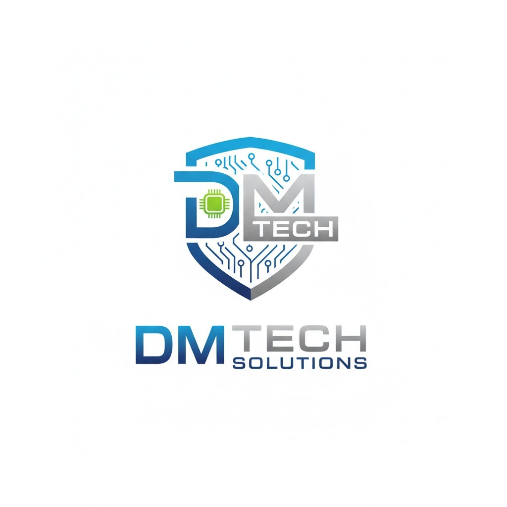

# 🖥️ DM TECH SOLUTIONS - Landing Page Empresarial

<div align="center">



**Tecnología Empresarial de Vanguardia**

*Soluciones tecnológicas integrales para empresas modernas*

[Ver Demo](http://localhost:8080/dmtechsolutions) • [Documentación](#-documentación) • [Soporte](#-soporte)

</div>

---

## 📋 Descripción del Proyecto

Landing page **empresarial y tecnológica** de última generación para **DM Tech Solutions**, empresa especializada en:

- 🛠️ Soporte Técnico Empresarial 24/7
- 🖥️ Infraestructura y Mantenimiento TI
- 🌐 Arquitectura de Redes Corporativas
- 💻 Ingeniería de Software a Medida

Diseño **profesional**, **moderno** y orientado a resultados con enfoque en conversión y experiencia de usuario.

---

## ✨ Características Premium

### 🎨 Diseño Corporativo
- ✅ Paleta de colores empresarial moderna (azul tecnológico + verde corporativo)
- ✅ Tipografía Inter (profesional y legible)
- ✅ Logo integrado en header y footer
- ✅ Iconografía Font Awesome Pro
- ✅ Gradientes y efectos glassmorphism

### 🚀 Tecnología Avanzada
- ✅ Animaciones suaves y profesionales
- ✅ Efectos parallax en hero section
- ✅ Fondo tecnológico animado con grid
- ✅ Contadores animados con IntersectionObserver
- ✅ Formulario de contacto con integración WhatsApp
- ✅ Notificaciones toast personalizadas

### 📱 Responsive & Performance
- ✅ 100% responsive (Mobile, Tablet, Desktop)
- ✅ Optimizado para velocidad de carga
- ✅ Lazy loading de elementos
- ✅ Transiciones fluidas CSS3
- ✅ Compatible con todos los navegadores modernos

### 🎯 Funcionalidades Empresariales
- ✅ Sección de estadísticas con KPIs
- ✅ Badges de categorías de servicios
- ✅ Formulario corporativo completo
- ✅ Footer con múltiples columnas de información
- ✅ Call-to-actions estratégicamente ubicados

---

## 📁 Estructura del Proyecto

```
dmtechsolutions/
│
├── index.html              # Página principal HTML5
├── README.md               # Este archivo
├── GUARDAR_LOGO.txt        # Instrucciones para guardar logo
│
├── css/
│   └── styles.css          # Estilos CSS3 empresariales
│
├── js/
│   └── main.js             # JavaScript ES6+ con efectos
│
└── images/
    └── logo.jpeg            # Logo de DM Tech Solutions
```

---

## 🛠️ Tecnologías Utilizadas

### Frontend Core
| Tecnología | Versión | Propósito |
|------------|---------|-----------|
| HTML5 | Latest | Estructura semántica |
| CSS3 | Latest | Estilos avanzados + animaciones |
| JavaScript | ES6+ | Interactividad moderna |
| Font Awesome | 6.4.0 | Iconografía profesional |
| Google Fonts | - | Tipografía Inter |

### Características CSS
- **Flexbox** y **Grid** para layouts modernos
- **Custom Properties (CSS Variables)** para tematización
- **Animations** y **Keyframes** para efectos suaves
- **Media Queries** para diseño responsive
- **Backdrop-filter** para efectos glassmorphism
- **Gradients** lineales y radiales

### Características JavaScript
- **ES6 Modules** y Arrow Functions
- **IntersectionObserver API** para animaciones al scroll
- **Smooth Scrolling** nativo
- **Event Delegation** para performance
- **LocalStorage** (preparado para expansión)

---

## 💻 Instalación y Configuración

### Requisitos Previos
- ✅ XAMPP instalado y funcionando
- ✅ Apache corriendo en puerto 8080
- ✅ Navegador moderno (Chrome 90+, Firefox 88+, Edge 90+)

### Pasos de Instalación

#### 1. Verificar XAMPP
```bash
# El proyecto debe estar en:
c:\xampp\htdocs\dmtechsolutions\
```

#### 2. Guardar el Logo
1. Abre la carpeta `images/`
2. Guarda el logo de DM Tech Solutions como `logo.jpeg`
3. Formato recomendado: PNG con transparencia
4. Dimensiones: 400x400px o superior

#### 3. Iniciar Apache
1. Abre el **Panel de Control de XAMPP**
2. Click en **Start** en el módulo Apache
3. Verifica que diga "Running"

#### 4. Acceder al Sitio
```
http://localhost:8080/dmtechsolutions
```

---

## ⚙️ Configuración Personalizada

### 🔧 Actualizar Número de WhatsApp

Busca y reemplaza en **2 ubicaciones**:

**1. En index.html (línea ~368):**
```html
<a href="https://wa.me/573113601362" target="_blank">
```

**2. En js/main.js (línea ~124):**
```javascript
const whatsappNumber = '573113601362';
```

Reemplaza `573113601362` con tu número (incluye código de país sin +).

**Formato correcto:**
- Colombia: `573001234567`
- México: `525512345678`
- España: `34612345678`

### 🎨 Cambiar Colores Corporativos

En `css/styles.css` (líneas 13-18):

```css
:root {
    --primary-color: #0066FF;        /* Azul principal */
    --primary-dark: #0052CC;         /* Azul oscuro */
    --secondary-color: #00C9A7;      /* Verde corporativo */
    --accent-color: #FF6B35;         /* Naranja acento */
    --bg-dark: #0A1929;              /* Fondo oscuro */
}
```

### 📧 Actualizar Información de Contacto

En `index.html` (sección Footer):

```html
<p><i class="fas fa-envelope"></i> info@dmtechsolutions.com</p>
<p><i class="fas fa-phone"></i> +57 (311) 360-1362</p>
```

### 📊 Modificar Estadísticas

En `index.html` (sección Hero Stats):

```html
<div class="stat">
    <span class="stat-number">500+</span>
    <span class="stat-label">Clientes Satisfechos</span>
</div>
```

---

## 🎨 Paleta de Colores Empresarial

| Color | Hex | RGB | Uso |
|-------|-----|-----|-----|
| 🔵 Azul Principal | `#0066FF` | `0, 102, 255` | Botones, enlaces, destacados |
| 🔷 Azul Oscuro | `#0052CC` | `0, 82, 204` | Hover, gradientes |
| 🟢 Verde Corporativo | `#00C9A7` | `0, 201, 167` | Secundario, badges |
| 🟠 Naranja Acento | `#FF6B35` | `255, 107, 53` | Alertas, badges especiales |
| ⚫ Fondo Oscuro | `#0A1929` | `10, 25, 41` | Headers, footers |
| ⚪ Fondo Claro | `#F8FAFC` | `248, 250, 252` | Secciones alternas |

---

## 📱 Diseño Responsive

### Breakpoints

| Dispositivo | Ancho | Ajustes |
|-------------|-------|---------|
| 📱 Mobile | < 480px | Columna única, texto reducido |
| 📱 Mobile L | < 768px | 2 columnas, navegación vertical |
| 💻 Tablet | < 1024px | Grids adaptativos |
| 🖥️ Desktop | > 1024px | Diseño completo |

### Características Responsive
- ✅ Imágenes fluidas
- ✅ Grids adaptativos
- ✅ Tipografía escalable con `clamp()`
- ✅ Navegación mobile-friendly
- ✅ Botones táctiles (min 44x44px)

---

## 🚀 Secciones de la Landing Page

### 1. **Header Sticky**
- Logo de DM Tech Solutions
- Navegación principal
- Efecto de elevación al hacer scroll

### 2. **Hero Section**
- Fondo tecnológico animado con grid
- Título principal con gradiente
- Subtítulo corporativo
- 2 CTAs (primario y secundario)
- 3 estadísticas clave con contadores animados

### 3. **Banner Tecnológico**
- Mensaje de valor corporativo
- Diseño de barra destacada

### 4. **Servicios** (4 tarjetas)
- Soporte Técnico Empresarial
- Infraestructura y Mantenimiento
- Arquitectura de Redes
- Ingeniería de Software
- Badges de categoría
- Lista de características
- Efectos hover 3D

### 5. **Misión, Visión y Valores**
- 3 tarjetas en grid
- Iconos representativos
- Fondo oscuro corporativo
- Valores corporativos en grid

### 6. **Ventajas Competitivas** (6 características)
- Equipo certificado
- Soporte 24/7
- Seguridad garantizada
- Escalabilidad
- Personalización
- Relación a largo plazo

### 7. **Contacto**
- Formulario completo funcional
- Integración directa con WhatsApp
- 3 métodos de contacto destacados
- Diseño en 2 columnas

### 8. **Footer Corporativo**
- Logo
- 4 columnas de información
- Enlaces rápidos
- Información de contacto
- Copyright y slogan

---

## 🎯 Funcionalidades JavaScript

### 🔄 Scroll Suave
```javascript
// Navegación smooth scroll
document.querySelectorAll('a[href^="#"]').forEach(...)
```

### 👁️ Animaciones al Scroll
```javascript
// IntersectionObserver para animaciones
const observer = new IntersectionObserver(...)
```

### 📊 Contadores Animados
```javascript
// Stats counter con animación
animateCounter(element, target, duration)
```

### 📝 Formulario Inteligente
```javascript
// Envío a WhatsApp con datos pre-cargados
contactForm.addEventListener('submit', ...)
```

### 🎨 Efectos Parallax
```javascript
// Parallax en hero section
window.addEventListener('scroll', ...)
```

### 🖱️ Efecto Tilt en Tarjetas
```javascript
// Efecto 3D con movimiento del mouse
card.addEventListener('mousemove', ...)
```

---

## 🔍 SEO y Optimización

### Meta Tags Incluidos
```html
<meta name="description" content="DM Tech Solutions - Soluciones tecnológicas empresariales...">
<meta name="viewport" content="width=device-width, initial-scale=1.0">
<meta charset="UTF-8">
```

### Recomendaciones Adicionales

#### Para Producción
- [ ] Agregar `robots.txt`
- [ ] Implementar `sitemap.xml`
- [ ] Configurar Google Analytics
- [ ] Añadir Open Graph tags para redes sociales
- [ ] Implementar Schema.org markup
- [ ] Agregar favicon y touch icons
- [ ] Minificar CSS y JavaScript
- [ ] Optimizar imágenes (WebP)
- [ ] Configurar HTTPS
- [ ] Implementar CDN

#### Meta Tags Recomendados
```html
<!-- Open Graph / Facebook -->
<meta property="og:type" content="website">
<meta property="og:url" content="https://dmtechsolutions.com/">
<meta property="og:title" content="DM Tech Solutions - Tecnología Empresarial">
<meta property="og:description" content="Soluciones tecnológicas integrales...">
<meta property="og:image" content="https://dmtechsolutions.com/images/og-image.png">

<!-- Twitter -->
<meta property="twitter:card" content="summary_large_image">
<meta property="twitter:url" content="https://dmtechsolutions.com/">
<meta property="twitter:title" content="DM Tech Solutions">
<meta property="twitter:description" content="Soluciones tecnológicas integrales...">
<meta property="twitter:image" content="https://dmtechsolutions.com/images/twitter-image.png">
```

---

## 🐛 Solución de Problemas

### El sitio no carga

**Problema:** No se visualiza nada al acceder.

**Soluciones:**
1. Verifica que Apache esté corriendo en XAMPP
2. Confirma la URL: `http://localhost:8080/dmtechsolutions`
3. Revisa que la carpeta esté en `c:\xampp\htdocs\`
4. Comprueba el puerto en XAMPP (debe ser 8080)

### El logo no aparece

**Problema:** Se muestra un ícono roto en lugar del logo.

**Soluciones:**
1. Verifica que `images/logo.jpeg` existe
2. Asegúrate de que el archivo se llama exactamente `logo.jpeg`
3. Verifica los permisos del archivo
4. Limpia el caché del navegador (Ctrl + F5)

### Los estilos no se aplican

**Problema:** La página se ve sin formato.

**Soluciones:**
1. Verifica que `css/styles.css` existe
2. Abre DevTools (F12) y revisa la consola
3. Comprueba que no hay errores 404
4. Limpia el caché (Ctrl + Shift + R)
5. Verifica la ruta en el `<link>` del HTML

### Las animaciones no funcionan

**Problema:** No hay efectos al hacer scroll.

**Soluciones:**
1. Verifica que `js/main.js` se está cargando
2. Abre la consola (F12) para ver errores
3. Asegúrate de que JavaScript está habilitado
4. Prueba en modo incógnito

### El formulario no envía

**Problema:** Al enviar el formulario no pasa nada.

**Soluciones:**
1. Verifica que el número de WhatsApp está actualizado
2. Asegúrate de que WhatsApp Web está activo
3. Revisa permisos de pop-ups en el navegador
4. Comprueba la consola JavaScript (F12)

---

## 📊 Métricas y Análisis

### Para Implementar Google Analytics

1. **Crear cuenta en Google Analytics**
2. **Obtener ID de medición** (G-XXXXXXXXXX)
3. **Agregar código en `<head>`:**

```html
<!-- Google Analytics -->
<script async src="https://www.googletagmanager.com/gtag/js?id=G-XXXXXXXXXX"></script>
<script>
  window.dataLayer = window.dataLayer || [];
  function gtag(){dataLayer.push(arguments);}
  gtag('js', new Date());
  gtag('config', 'G-XXXXXXXXXX');
</script>
```

### Métricas Importantes a Monitorear
- 📊 Visitantes únicos
- ⏱️ Tiempo en página
- 🖱️ Tasa de rebote
- 🎯 Conversiones (clicks en WhatsApp)
- 📱 Dispositivos utilizados
- 🌍 Ubicación geográfica

---

## 🔐 Seguridad

### Recomendaciones

#### Desarrollo Local
- ✅ No exponer información sensible en código
- ✅ Usar XAMPP solo para desarrollo
- ✅ No compartir credenciales

#### Producción
- ✅ Implementar HTTPS (SSL/TLS)
- ✅ Configurar headers de seguridad
- ✅ Validar entradas del formulario server-side
- ✅ Proteger contra XSS
- ✅ Implementar rate limiting
- ✅ Mantener software actualizado

### Headers de Seguridad Recomendados
```apache
# .htaccess
Header set X-XSS-Protection "1; mode=block"
Header set X-Frame-Options "SAMEORIGIN"
Header set X-Content-Type-Options "nosniff"
Header set Referrer-Policy "strict-origin-when-cross-origin"
```

---

## 🚀 Despliegue a Producción

### Opciones de Hosting

#### Hosting Compartido
- **Hostinger** - Económico, buen soporte
- **SiteGround** - Rendimiento optimizado
- **Bluehost** - Fácil de usar

#### Cloud/VPS
- **DigitalOcean** - Droplets desde $5/mes
- **AWS Lightsail** - Escalable
- **Google Cloud** - Alta disponibilidad

### Pasos para Publicar

#### 1. Preparar Archivos
```bash
# Minificar CSS
# Minificar JavaScript
# Optimizar imágenes
# Actualizar URLs absolutas
```

#### 2. Configurar Hosting
- Crear cuenta
- Configurar dominio
- Configurar DNS
- Instalar SSL

#### 3. Subir Archivos
```bash
# Via FTP/SFTP
# Via cPanel File Manager
# Via Git deployment
```

#### 4. Verificar
- Probar todas las funcionalidades
- Verificar formularios
- Comprobar enlaces
- Probar en diferentes dispositivos

---

## 📞 Información de Contacto

### En la Página
- **WhatsApp:** [Actualizar número]
- **Email:** info@dmtechsolutions.com
- **Teléfono:** +57 (311) 360-1362
- **Disponibilidad:** 24/7

### Soporte del Sitio Web
Para consultas sobre el desarrollo del sitio:
- 📧 Email: [tu-email]
- 💬 WhatsApp: [tu-número]

---

## 📚 Recursos Adicionales

### Documentación
- [MDN Web Docs](https://developer.mozilla.org/) - Referencia HTML/CSS/JS
- [CSS-Tricks](https://css-tricks.com/) - Trucos y técnicas CSS
- [Font Awesome](https://fontawesome.com/) - Iconos
- [Google Fonts](https://fonts.google.com/) - Tipografías

### Herramientas Útiles
- **Visual Studio Code** - Editor de código
- **Chrome DevTools** - Debugging
- **Lighthouse** - Auditoría de performance
- **PageSpeed Insights** - Optimización
- **GTmetrix** - Análisis de velocidad

### Inspiración de Diseño
- **Dribbble** - Diseños corporativos
- **Behance** - Portfolios de diseño
- **Awwwards** - Sitios web premiados

---

## 🔄 Actualizaciones Futuras Recomendadas

### Fase 1 (Corto Plazo - 1-2 meses)
- [ ] Blog técnico corporativo
- [ ] Galería de proyectos/portfolio
- [ ] Testimonios de clientes
- [ ] Sección de equipo
- [ ] Chat en vivo (Tawk.to, Tidio)

### Fase 2 (Mediano Plazo - 3-6 meses)
- [ ] Sistema de tickets de soporte
- [ ] Base de conocimiento/FAQ
- [ ] Portal de clientes
- [ ] Calculadora de cotizaciones
- [ ] Integración con CRM

### Fase 3 (Largo Plazo - 6-12 meses)
- [ ] Aplicación móvil
- [ ] Dashboard de servicios
- [ ] Sistema de pagos online
- [ ] API para integraciones
- [ ] Marketplace de servicios

---

## ⚡ Performance

### Métricas Objetivo
- **LCP** (Largest Contentful Paint): < 2.5s
- **FID** (First Input Delay): < 100ms
- **CLS** (Cumulative Layout Shift): < 0.1
- **TTI** (Time to Interactive): < 3.5s

### Optimizaciones Implementadas
- ✅ CSS minificado y optimizado
- ✅ JavaScript asíncrono
- ✅ Lazy loading de imágenes
- ✅ Fuentes web optimizadas
- ✅ Compresión de recursos

---

## 📝 Changelog

### Versión 2.0.0 Enterprise (27 Dic 2025)
- 🎨 **Nuevo:** Diseño completamente empresarial y tecnológico
- 🖼️ **Nuevo:** Integración de logo corporativo
- ✨ **Nuevo:** Animaciones y efectos avanzados
- 🎯 **Nuevo:** Formulario de contacto funcional
- 📱 **Mejorado:** Diseño responsive optimizado
- 🚀 **Mejorado:** Performance y velocidad de carga
- 💼 **Mejorado:** Contenido empresarial profesional

### Versión 1.0.0 (Inicial)
- ✅ Estructura básica HTML
- ✅ Estilos CSS fundamentales
- ✅ JavaScript básico

---

## 📄 Licencia y Uso

© 2025 **DM Tech Solutions**. Todos los derechos reservados.

### Términos de Uso
- ✅ **Permitido:** Uso interno de la empresa
- ✅ **Permitido:** Modificaciones y personalizaciones
- ✅ **Permitido:** Despliegue en servidores propios
- ❌ **Prohibido:** Redistribución sin autorización
- ❌ **Prohibido:** Uso del código para competidores
- ❌ **Prohibido:** Reventa del template

---

## 🤝 Contribuciones y Soporte

### ¿Encontraste un bug?
1. Verifica que no esté ya reportado
2. Documenta el problema con capturas
3. Incluye pasos para reproducirlo
4. Contacta al equipo de desarrollo

### ¿Tienes una sugerencia?
1. Describe la funcionalidad deseada
2. Explica el beneficio para el negocio
3. Proporciona ejemplos visuales si es posible

---

## 🏆 Créditos

### Desarrollo y Diseño
**DM Tech Solutions - Equipo de Desarrollo Web**

### Tecnologías de Terceros
- **Font Awesome** - Sistema de iconos
- **Google Fonts** - Tipografía Inter
- **Inter Font** - Diseñada por Rasmus Andersson

---

## 💡 Slogan Corporativo

<div align="center">

### **"Tecnología Empresarial de Vanguardia"**

*Transformando la infraestructura digital de las empresas modernas*

---

**DM TECH SOLUTIONS**  
🚀 Innovación • 🛡️ Seguridad • ⚡ Eficiencia

</div>

---

## 📞 Contacto Final

<div align="center">

**¿Listo para transformar tu infraestructura tecnológica?**

[](https://wa.me/573113601362)
[](mailto:info@dmtechsolutions.com)

**Visita nuestra web:** http://localhost:8080/dmtechsolutions

</div>

---

<div align="center">

**Última actualización:** 27 de diciembre de 2025  
**Versión:** 2.0.0 Enterprise  
**Estado:** ✅ Producción Ready

Made with 💙 by DM Tech Solutions

</div>
